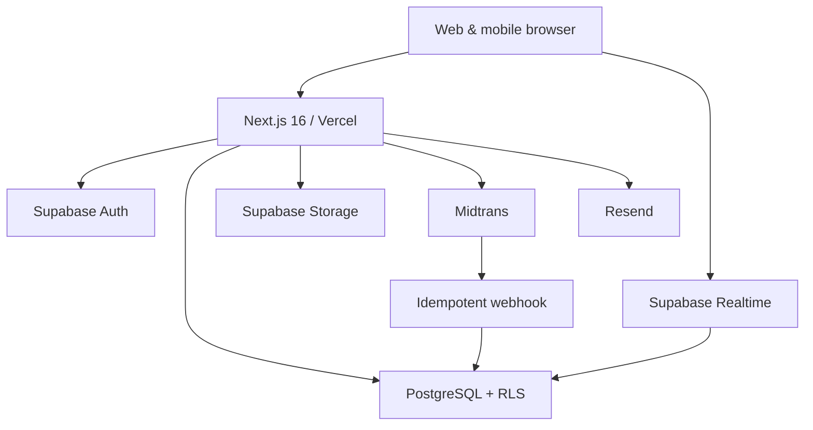
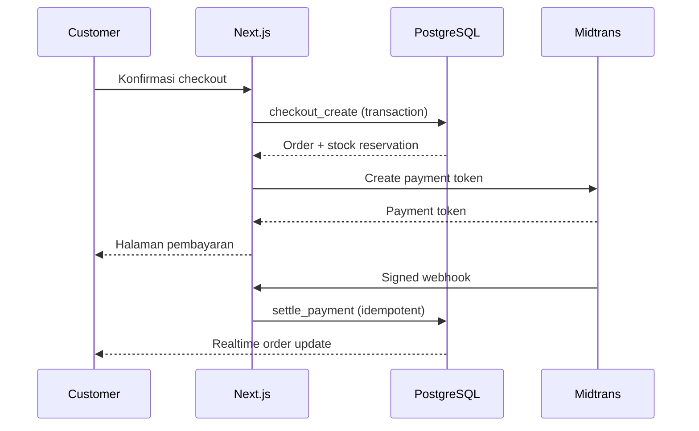

# Arsitektur Sistem NexaCommerce

## Sasaran

NexaCommerce adalah marketplace multi-seller untuk Indonesia. Arsitektur memisahkan UI, aturan bisnis, akses data, dan integrasi pihak ketiga agar setiap domain dapat dikembangkan serta diuji tanpa mencampur tanggung jawab.

## Gambaran Sistem

## Batas Domain

| Domain     | Tanggung jawab                                   | Direktori utama                     |
| ---------- | ------------------------------------------------ | ----------------------------------- |
| Identity   | Profil, alamat, RBAC, status akun                | `features/auth`, `features/profile` |
| Catalog    | Kategori, brand, produk, variasi, media          | `features/catalog`                  |
| Inventory  | Stok tersedia, reservasi, pergerakan stok        | `features/inventory`                |
| Cart       | Keranjang guest dan sinkronisasi customer        | `features/cart`                     |
| Checkout   | Validasi harga, voucher, ongkir, transaksi order | `features/checkout`                 |
| Orders     | Lifecycle pesanan, shipment, pembatalan          | `features/orders`                   |
| Payments   | Midtrans, webhook, event, refund                 | `features/payments`                 |
| Engagement | Wishlist, review, chat, notifikasi               | `features/engagement`               |
| Seller     | Toko, anggota, promosi, saldo, payout            | `features/seller`                   |
| Admin      | Moderasi, CMS, konfigurasi, laporan, audit       | `features/admin`                    |

Setiap domain mengikuti arah dependensi: `UI → application service → repository → Supabase/PostgreSQL`. Komponen UI tidak boleh mengakses service-role key atau menghitung total transaksi final.

## Pola Request

- Server Components membaca data publik atau data pengguna melalui Supabase server client.
- Client Components dipakai hanya untuk interaksi, state lokal, TanStack Query, dan subscription real-time.
- Server Actions menangani mutasi dari form aplikasi dan selalu memvalidasi input dengan Zod.
- Route Handlers menangani webhook Midtrans, upload bertanda tangan, dan endpoint cron.
- PostgreSQL function digunakan untuk operasi atomik seperti checkout, reservasi stok, payment settlement, dan refund.
- Outbox events menjamin side effect email/notifikasi tidak hilang setelah transaksi database berhasil.

## Sumber Kebenaran

| Data                 | Sumber kebenaran                            |
| -------------------- | ------------------------------------------- |
| Identitas dan sesi   | Supabase Auth                               |
| Role, profil, seller | PostgreSQL `public` schema                  |
| Harga, stok, promo   | PostgreSQL; selalu dihitung ulang di server |
| Keranjang guest      | Zustand + localStorage                      |
| Keranjang customer   | PostgreSQL, disinkronkan saat login         |
| Status pembayaran    | Webhook Midtrans terverifikasi              |
| Status pengiriman    | Shipment dan tracking event                 |
| Gambar               | Supabase Storage; metadata di PostgreSQL    |
| UI server state      | TanStack Query cache, bukan sumber permanen |

## Model Keamanan

1. Public browser hanya menerima Supabase publishable key.
2. Service-role key hanya boleh di modul `server-only` dan job tepercaya.
3. Semua tabel berisi data pengguna mengaktifkan RLS.
4. Authorization memeriksa JWT tervalidasi (`getClaims`) dan role database.
5. Seller mengakses data melalui `store_members`; tidak berdasarkan `seller_id` dari input client.
6. Webhook Midtrans diverifikasi signature-nya, disimpan sebagai event unik, lalu diproses idempoten.
7. Checkout mengunci varian yang dibeli dan membuat reservasi stok dalam satu transaksi.
8. Total order, diskon, biaya, dan pajak disimpan sebagai integer Rupiah (`bigint`), tanpa floating point.
9. Audit log bersifat append-only dan menyimpan actor, action, target, IP hash, serta metadata aman.
10. Rate limiting diterapkan pada login, register, reset password, voucher, chat, dan webhook.

## Konsistensi Transaksi

Jika pembuatan token pembayaran gagal, order tetap berstatus `payment_pending` dan dapat dicoba ulang sampai reservasi kedaluwarsa. Cron melepas reservasi hanya untuk order yang belum dibayar.

## Strategi Real-Time

- Channel dibatasi per user, store, atau conversation; tidak ada broadcast data global sensitif.
- RLS tetap menjadi gerbang untuk perubahan Postgres yang disiarkan.
- Event utama: order status, stock availability, message insert, notification insert, seller dashboard counters.
- Client melakukan invalidasi query setelah event, bukan mengganti seluruh state bisnis hanya dari payload realtime.

## Deployment

- Frontend dan server runtime: Vercel.
- Database, Auth, Realtime, Storage: satu Supabase production project per environment.
- Preview memakai Supabase staging terpisah; production secret tidak digunakan pada PR preview.
- Migration dijalankan sekali lewat pipeline sebelum deployment aplikasi yang membutuhkannya.
- Observability minimum: Vercel logs, Supabase logs, webhook event log, error tracker, dan alert job gagal.

## Keputusan Awal

- Supabase adalah akses data utama; Prisma tidak ditambahkan sampai ada kebutuhan query server khusus yang tidak tertangani dengan baik.
- Next.js `proxy.ts` hanya memperbarui sesi. Keputusan akses tetap dilakukan dekat dengan query/mutasi dan diperkuat oleh RLS.
- Rupiah disimpan sebagai integer untuk mencegah error pembulatan.
- Soft delete dipakai pada katalog dan akun; order, pembayaran, ledger, dan audit tidak boleh dihapus permanen.
- Tabel ledger menggunakan model double-entry pada Tahap 6–7 agar saldo seller dapat diaudit.
