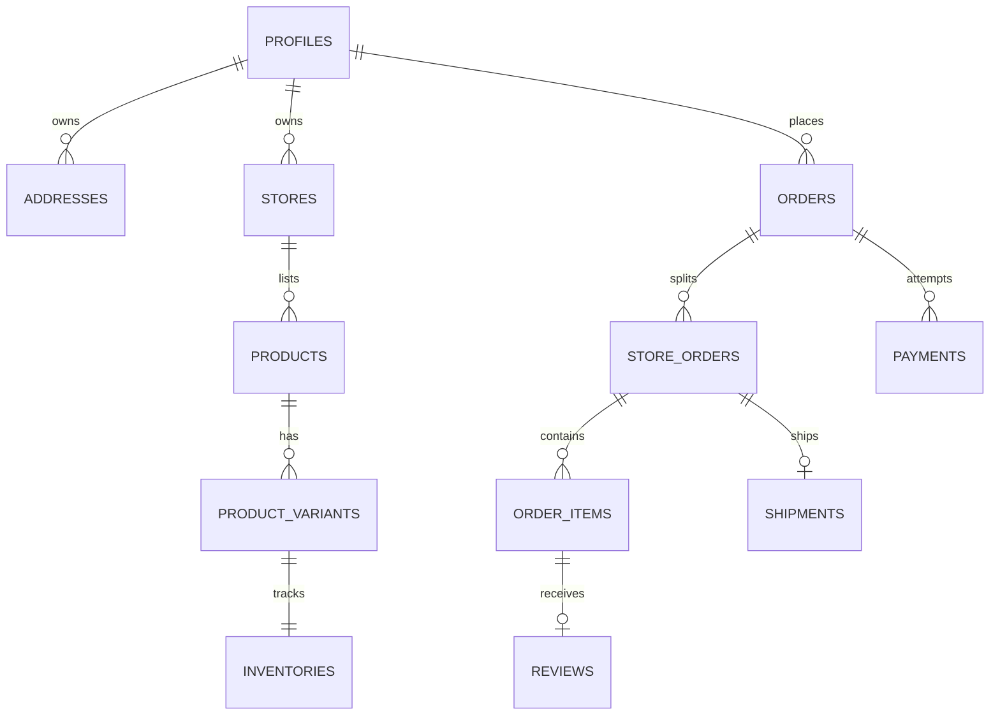

# Blueprint Database NexaCommerce

Dokumen ini adalah kontrak schema untuk migration Tahap 2. PostgreSQL `public` memakai UUID, `timestamptz`, dan nilai uang `bigint` dalam Rupiah. Semua nama tabel/kolom menggunakan `snake_case`.

## Enum

| Enum                      | Nilai                                                                                                    |
| ------------------------- | -------------------------------------------------------------------------------------------------------- |
| `app_role`                | `customer`, `seller`, `admin`                                                                            |
| `account_status`          | `active`, `suspended`, `blocked`, `deleted`                                                              |
| `seller_status`           | `draft`, `submitted`, `verified`, `rejected`, `suspended`                                                |
| `product_status`          | `draft`, `pending_review`, `active`, `rejected`, `archived`                                              |
| `inventory_movement_type` | `initial`, `purchase`, `sale`, `reservation`, `release`, `adjustment`, `return`                          |
| `voucher_type`            | `fixed`, `percentage`, `free_shipping`                                                                   |
| `order_status`            | `payment_pending`, `paid`, `processing`, `shipped`, `delivered`, `completed`, `cancelled`, `refunded`    |
| `store_order_status`      | `new`, `accepted`, `packed`, `shipped`, `delivered`, `completed`, `cancelled`                            |
| `payment_status`          | `pending`, `authorized`, `settlement`, `deny`, `cancel`, `expire`, `refund`, `partial_refund`, `failure` |
| `refund_status`           | `requested`, `reviewing`, `approved`, `rejected`, `processing`, `completed`, `failed`                    |
| `shipment_status`         | `ready`, `picked_up`, `in_transit`, `out_for_delivery`, `delivered`, `returned`, `lost`                  |
| `notification_type`       | `order`, `payment`, `shipment`, `chat`, `review`, `promotion`, `system`                                  |
| `ledger_direction`        | `debit`, `credit`                                                                                        |
| `payout_status`           | `requested`, `processing`, `paid`, `failed`, `cancelled`                                                 |

## Identity dan RBAC

| Tabel              | Kolom inti                                                                                                                                                                                         | Constraint / relasi                                                          |
| ------------------ | -------------------------------------------------------------------------------------------------------------------------------------------------------------------------------------------------- | ---------------------------------------------------------------------------- |
| `profiles`         | `id uuid`, `full_name text`, `email text`, `whatsapp text`, `avatar_path text`, `status account_status`, `timezone text`, `last_seen_at timestamptz`, timestamps, `deleted_at`                     | `id → auth.users.id`; email `citext` unique; timezone default `Asia/Jakarta` |
| `user_roles`       | `user_id uuid`, `role app_role`, `granted_by uuid`, `granted_at timestamptz`                                                                                                                       | PK `(user_id, role)`; admin grant hanya lewat privileged function            |
| `addresses`        | `id`, `user_id`, `label`, `recipient_name`, `phone`, `province_code`, `city_code`, `district_code`, `postal_code`, `address_line`, `latitude`, `longitude`, `is_primary`, timestamps, `deleted_at` | Partial unique satu alamat primer aktif per user                             |
| `auth_attempts`    | `id`, `identifier_hash`, `ip_hash`, `action`, `success`, `attempted_at`                                                                                                                            | Retention terbatas; index `(identifier_hash, attempted_at desc)`             |
| `idempotency_keys` | `id`, `scope`, `key`, `request_hash`, `response_code`, `response_body jsonb`, `locked_at`, `completed_at`, `expires_at`                                                                            | Unique `(scope, key)`                                                        |

## Seller dan Toko

| Tabel                 | Kolom inti                                                                                                                                                                                                                               | Constraint / relasi                                  |
| --------------------- | ---------------------------------------------------------------------------------------------------------------------------------------------------------------------------------------------------------------------------------------- | ---------------------------------------------------- |
| `seller_applications` | `id`, `user_id`, `legal_name`, `identity_number_ciphertext`, `identity_document_path`, `tax_number_ciphertext`, `status seller_status`, `review_notes`, `submitted_at`, `reviewed_by`, `reviewed_at`, timestamps                         | Satu aplikasi aktif per user; dokumen bucket private |
| `stores`              | `id`, `owner_id`, `name`, `slug`, `description`, `logo_path`, `banner_path`, `province_code`, `city_code`, `status seller_status`, `is_official`, `rating_average numeric(3,2)`, `rating_count`, `sales_count`, timestamps, `deleted_at` | `slug` unique; rating 0..5                           |
| `store_members`       | `store_id`, `user_id`, `member_role`, `permissions jsonb`, `invited_by`, timestamps                                                                                                                                                      | PK `(store_id, user_id)`; owner wajib menjadi member |
| `store_settings`      | `store_id`, `auto_accept_order`, `processing_days`, `min_order_amount`, `chat_enabled`, `vacation_mode`, `metadata jsonb`, `updated_at`                                                                                                  | PK/FK `store_id`                                     |

## Katalog

| Tabel                      | Kolom inti                                                                                                                                                                                                                                                                            | Constraint / relasi                                                          |
| -------------------------- | ------------------------------------------------------------------------------------------------------------------------------------------------------------------------------------------------------------------------------------------------------------------------------------- | ---------------------------------------------------------------------------- |
| `categories`               | `id`, `parent_id`, `name`, `slug`, `description`, `icon_path`, `sort_order`, `is_active`, timestamps                                                                                                                                                                                  | Self-reference; unique `(parent_id, slug)`; cegah cycle via trigger          |
| `brands`                   | `id`, `name`, `slug`, `logo_path`, `is_verified`, timestamps                                                                                                                                                                                                                          | `slug` unique                                                                |
| `products`                 | `id`, `store_id`, `category_id`, `brand_id`, `name`, `slug`, `short_description`, `description`, `status product_status`, `condition`, `weight_grams`, `length_cm`, `width_cm`, `height_cm`, `rating_average`, `rating_count`, `sold_count`, `published_at`, timestamps, `deleted_at` | Unique `(store_id, slug)`; dimensi/berat non-negatif                         |
| `product_images`           | `id`, `product_id`, `storage_path`, `alt_text`, `sort_order`, `is_primary`, timestamps                                                                                                                                                                                                | Partial unique satu gambar primer per produk                                 |
| `product_options`          | `id`, `product_id`, `name`, `sort_order`                                                                                                                                                                                                                                              | Unique `(product_id, name)`                                                  |
| `product_option_values`    | `id`, `option_id`, `value`, `sort_order`                                                                                                                                                                                                                                              | Unique `(option_id, value)`                                                  |
| `product_variants`         | `id`, `product_id`, `sku`, `name`, `price bigint`, `compare_at_price bigint`, `cost_price bigint`, `weight_grams`, `is_active`, timestamps, `deleted_at`                                                                                                                              | SKU unique per store melalui index; harga >= 0; compare >= price jika terisi |
| `variant_option_values`    | `variant_id`, `option_value_id`                                                                                                                                                                                                                                                       | PK pasangan; trigger memastikan produk sama dan kombinasi unik               |
| `product_search_documents` | `product_id`, `document tsvector`, `search_text text`, `updated_at`                                                                                                                                                                                                                   | GIN pada `document`; diperbarui trigger                                      |

## Inventory

| Tabel                 | Kolom inti                                                                                                                                 | Constraint / relasi                                                                                     |
| --------------------- | ------------------------------------------------------------------------------------------------------------------------------------------ | ------------------------------------------------------------------------------------------------------- |
| `inventories`         | `variant_id`, `on_hand`, `reserved`, `reorder_point`, `version`, `updated_at`                                                              | PK `variant_id`; `on_hand >= 0`, `reserved >= 0`, `reserved <= on_hand`; available = on_hand - reserved |
| `inventory_movements` | `id`, `variant_id`, `type inventory_movement_type`, `quantity_delta`, `reference_type`, `reference_id`, `note`, `created_by`, `created_at` | Append-only; delta tidak nol; index variant/time                                                        |
| `stock_reservations`  | `id`, `order_id`, `variant_id`, `quantity`, `status`, `expires_at`, `released_at`, timestamps                                              | Unique `(order_id, variant_id)`; quantity > 0; partial index active expiration                          |

## Cart, Wishlist, dan Promo

| Tabel                 | Kolom inti                                                                                                                                                                             | Constraint / relasi                                                                     |
| --------------------- | -------------------------------------------------------------------------------------------------------------------------------------------------------------------------------------- | --------------------------------------------------------------------------------------- |
| `carts`               | `id`, `user_id`, `currency`, `expires_at`, timestamps                                                                                                                                  | Satu cart aktif per customer                                                            |
| `cart_items`          | `id`, `cart_id`, `variant_id`, `quantity`, `added_at`, `updated_at`                                                                                                                    | Unique `(cart_id, variant_id)`; quantity > 0; harga tidak disimpan sebagai sumber final |
| `wishlist_items`      | `user_id`, `product_id`, `created_at`                                                                                                                                                  | PK `(user_id, product_id)`                                                              |
| `vouchers`            | `id`, `store_id nullable`, `code`, `name`, `type voucher_type`, `value`, `max_discount`, `min_spend`, `usage_limit`, `per_user_limit`, `starts_at`, `ends_at`, `is_active`, timestamps | Code normalized unique sesuai scope; rentang dan nilai divalidasi                       |
| `voucher_scopes`      | `voucher_id`, `category_id nullable`, `product_id nullable`                                                                                                                            | Tepat satu target per row; voucher tanpa row berlaku ke scope pemilik                   |
| `voucher_redemptions` | `id`, `voucher_id`, `user_id`, `order_id`, `discount_amount`, `redeemed_at`, `voided_at`                                                                                               | Unique voucher/order; counter dicek dalam transaction                                   |
| `flash_sales`         | `id`, `name`, `starts_at`, `ends_at`, `status`, timestamps                                                                                                                             | `starts_at < ends_at`                                                                   |
| `flash_sale_items`    | `flash_sale_id`, `variant_id`, `sale_price`, `stock_quota`, `sold_quantity`                                                                                                            | PK pasangan; quota dan sold non-negatif                                                 |

## Checkout, Order, dan Pengiriman

| Tabel                      | Kolom inti                                                                                                                                                                                                                                                         | Constraint / relasi                                                |
| -------------------------- | ------------------------------------------------------------------------------------------------------------------------------------------------------------------------------------------------------------------------------------------------------------------ | ------------------------------------------------------------------ |
| `orders`                   | `id`, `order_number`, `user_id`, `status order_status`, snapshot alamat JSONB, `currency`, `subtotal`, `discount_total`, `shipping_total`, `service_fee_total`, `grand_total`, `voucher_id`, `placed_at`, `expires_at`, timestamps, `cancelled_at`, `completed_at` | Order number unique; semua total >= 0; persamaan grand total dicek |
| `store_orders`             | `id`, `order_id`, `store_id`, `status store_order_status`, `subtotal`, `discount_total`, `shipping_cost`, `service_fee`, `seller_net_amount`, `accepted_at`, `shipped_at`, `delivered_at`, timestamps                                                              | Unique `(order_id, store_id)`; sumber dashboard seller             |
| `order_items`              | `id`, `store_order_id`, `product_id`, `variant_id`, snapshot nama/SKU/opsi/gambar, `unit_price`, `quantity`, `discount_amount`, `line_total`, timestamps                                                                                                           | quantity > 0; snapshot immutable setelah order dibuat              |
| `order_status_history`     | `id`, `order_id`, `store_order_id nullable`, `from_status`, `to_status`, `actor_id`, `note`, `metadata jsonb`, `created_at`                                                                                                                                        | Append-only; index order/time                                      |
| `shipments`                | `id`, `store_order_id`, `courier_code`, `service_code`, `tracking_number`, `status shipment_status`, `shipping_cost`, `estimated_days`, `shipped_at`, `delivered_at`, timestamps                                                                                   | Tracking unique per courier jika terisi                            |
| `shipment_tracking_events` | `id`, `shipment_id`, `status`, `description`, `location`, `occurred_at`, `provider_event_id`, `raw_payload jsonb`                                                                                                                                                  | Unique provider event; append-only                                 |

## Pembayaran, Refund, dan Keuangan

| Tabel                 | Kolom inti                                                                                                                                                                                                             | Constraint / relasi                                                     |
| --------------------- | ---------------------------------------------------------------------------------------------------------------------------------------------------------------------------------------------------------------------- | ----------------------------------------------------------------------- |
| `payments`            | `id`, `order_id`, `provider`, `provider_order_id`, `provider_transaction_id`, `payment_type`, `status payment_status`, `gross_amount`, `fraud_status`, `transaction_time`, `settlement_time`, `expires_at`, timestamps | Unique provider transaction/order; gross amount sama dengan grand total |
| `payment_events`      | `id`, `payment_id nullable`, `provider_event_key`, `signature_valid`, `event_type`, `status_code`, `raw_payload jsonb`, `received_at`, `processed_at`, `processing_error`                                              | Provider event key unique; payload immutable; data sensitif disanitasi  |
| `refunds`             | `id`, `order_id`, `payment_id`, `requested_by`, `reason_code`, `reason_detail`, `amount`, `status refund_status`, `reviewed_by`, `provider_refund_id`, timestamps, `completed_at`                                      | Amount > 0 dan tidak melebihi refundable amount                         |
| `refund_items`        | `refund_id`, `order_item_id`, `quantity`, `amount`                                                                                                                                                                     | PK pasangan; quantity/amount positif                                    |
| `seller_accounts`     | `store_id`, `available_balance`, `pending_balance`, `held_balance`, `updated_at`, `version`                                                                                                                            | Saldo tidak diubah langsung; hasil proyeksi ledger                      |
| `ledger_accounts`     | `id`, `owner_type`, `owner_id`, `code`, `currency`, timestamps                                                                                                                                                         | Unique owner/code/currency                                              |
| `ledger_transactions` | `id`, `reference_type`, `reference_id`, `description`, `posted_at`, `created_at`                                                                                                                                       | Reference unique untuk idempotency                                      |
| `ledger_entries`      | `id`, `transaction_id`, `account_id`, `direction ledger_direction`, `amount`, `created_at`                                                                                                                             | amount > 0; total debit = credit divalidasi deferred trigger            |
| `payouts`             | `id`, `store_id`, `amount`, bank destination snapshot terenkripsi, `status payout_status`, `provider_reference`, timestamps, `paid_at`                                                                                 | Amount > 0; provider reference unique                                   |

## Engagement dan Konten

| Tabel                       | Kolom inti                                                                                                                                           | Constraint / relasi                                                      |
| --------------------------- | ---------------------------------------------------------------------------------------------------------------------------------------------------- | ------------------------------------------------------------------------ |
| `reviews`                   | `id`, `order_item_id`, `product_id`, `user_id`, `rating`, `title`, `body`, `is_visible`, timestamps, `deleted_at`                                    | Satu review per order item; rating 1..5; hanya order delivered/completed |
| `review_images`             | `id`, `review_id`, `storage_path`, `sort_order`, timestamps                                                                                          | Maksimum jumlah gambar via trigger                                       |
| `review_replies`            | `id`, `review_id`, `store_id`, `author_id`, `body`, timestamps, `deleted_at`                                                                         | Hanya anggota store pemilik produk                                       |
| `conversations`             | `id`, `store_id`, `product_id nullable`, `order_id nullable`, `last_message_at`, timestamps                                                          | Customer/store conversation identity di participant                      |
| `conversation_participants` | `conversation_id`, `user_id`, `last_read_at`, `joined_at`, `left_at`                                                                                 | PK pasangan                                                              |
| `messages`                  | `id`, `conversation_id`, `sender_id`, `body`, `attachment_path`, `client_message_id`, `created_at`, `deleted_at`                                     | Unique sender/client message; participant-only                           |
| `notifications`             | `id`, `user_id`, `type notification_type`, `title`, `body`, `action_url`, `data jsonb`, `read_at`, `created_at`                                      | Index unread per user; user tidak dapat insert sendiri                   |
| `banners`                   | `id`, `title`, `image_path`, `mobile_image_path`, `target_url`, `placement`, `starts_at`, `ends_at`, `sort_order`, `is_active`, timestamps           | Jadwal valid; admin write                                                |
| `content_pages`             | `id`, `slug`, `title`, `content jsonb`, `seo_title`, `seo_description`, `status`, `published_at`, timestamps                                         | Slug unique; draft/published                                             |
| `newsletter_subscribers`    | `id`, `email`, `status`, `consent_at`, `confirmed_at`, `unsubscribed_at`, timestamps                                                                 | Email normalized unique                                                  |
| `app_settings`              | `key`, `value jsonb`, `is_public`, `updated_by`, `updated_at`                                                                                        | PK key; public read hanya jika `is_public`                               |
| `audit_logs`                | `id`, `actor_id`, `actor_role`, `action`, `target_type`, `target_id`, `before_data jsonb`, `after_data jsonb`, `ip_hash`, `user_agent`, `created_at` | Append-only; admin read; index actor/target/time                         |
| `outbox_events`             | `id`, `topic`, `aggregate_type`, `aggregate_id`, `payload jsonb`, `attempts`, `available_at`, `processed_at`, `last_error`, `created_at`             | Worker lock dengan `for update skip locked`                              |

## ERD Inti

## Index Wajib

- GIN full-text search pada `product_search_documents.document` dan trigram pada nama produk/toko.
- Partial index produk aktif: `(category_id, published_at desc) where status = 'active' and deleted_at is null`.
- Partial index stok: `(variant_id) where on_hand > reserved`.
- Order customer: `(user_id, placed_at desc)`; seller: `(store_id, status, created_at desc)`.
- Payment event: unique `provider_event_key`; notification: `(user_id, created_at desc) where read_at is null`.
- Message: `(conversation_id, created_at desc)`; audit: `(target_type, target_id, created_at desc)`.
- Semua foreign key yang sering difilter memiliki index eksplisit.

## Ringkasan RLS

| Area           | Public              | Customer             | Seller                                 | Admin                  |
| -------------- | ------------------- | -------------------- | -------------------------------------- | ---------------------- |
| Katalog aktif  | Read                | Read                 | Read + CRUD milik store                | Semua                  |
| Profil/alamat  | Tidak               | Milik sendiri        | Milik sendiri                          | Read terbatas + status |
| Inventory      | Availability view   | Availability view    | Store sendiri                          | Semua                  |
| Cart/wishlist  | Tidak               | Milik sendiri        | Tidak                                  | Dukungan terbatas      |
| Order/payment  | Tidak               | Order sendiri        | Store-order sendiri; payment immutable | Semua sesuai tugas     |
| Chat           | Tidak               | Participant          | Participant                            | Moderasi ter-audit     |
| Review         | Read visible        | Insert order sendiri | Reply produk sendiri                   | Moderasi               |
| Ledger/payout  | Tidak               | Tidak                | Store sendiri (read)                   | Privileged service     |
| Audit/settings | Public setting only | Tidak                | Tidak                                  | Admin                  |

Policy detail dan helper function seperti `is_admin()`, `is_store_member(store_id)`, serta `owns_order(order_id)` dibuat pada migration Tahap 2. Service-role tidak digunakan sebagai pengganti RLS pada request user biasa.
